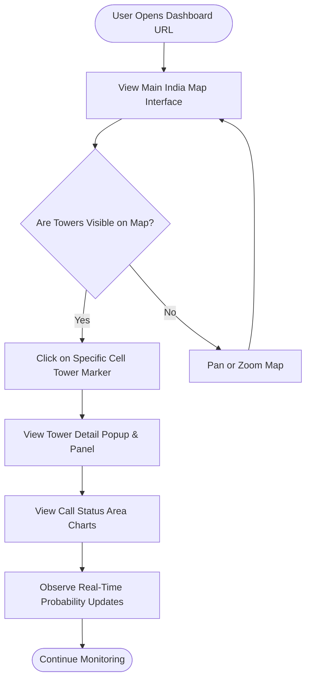
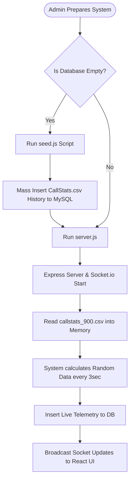
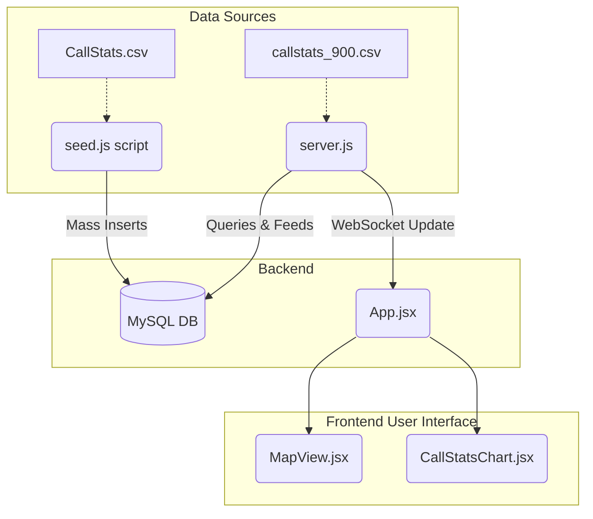

# Project Report: Cellular Network Dashboard

## 1. Problem Statement
Modern cellular network infrastructures are vast and highly complex. When a network issue occurs, such as high call drops, latency spikes, or failing towers, network operators and analysts often struggle to visualize the problem geographically in real-time. Without a centralized, interactive dashboard, telecom teams rely on fragmented raw data (CSV logs) and delayed reports, resulting in slower response times to cellular degradation and a poor experience for end-users.

## 2. Proposed Solution
The **Cellular Network Dashboard** was developed as a full-stack, real-time monitoring system. It provides a geographical interface (a map) where network analysts can actively monitor the health of cell towers across different regions. When a tower experiences high traffic or call failures, the dashboard instantly reflects these changes through visual indicators (colors, coverage radii) and live charts, allowing for immediate diagnosis and resolution.

## 3. How It Was Made (Technology Stack & Architecture)
The project follows a standard decoupled Client-Server architecture.

* **Frontend (User Interface):** Built with **React.js** and styled using **Tailwind CSS**. It uses **Leaflet.js** (`react-leaflet`) for rendering the interactive geographical map and **Recharts** to plot live telemetry graphs.
* **Backend (Server & Simulation):** Built using **Node.js** and **Express.js**. It features a **Socket.io** integration that establishes a persistent WebSocket connection with the frontend, pushing fresh telemetry data every 3 seconds to simulate live network traffic.
* **Database:** **MySQL** is used to store tower metadata, locations, and historical telemetry data.

## 4. Data Sourcing and Mechanics
Data simulation drives the dashboard, ensuring realistic visualization without needing a physical connection to an actual telecom ISP layout.
* **Raw Historical Data:** The database is initially populated using an administrative script (`seed.js`), which reads massive telecom logs from a local `CallStats.csv` file and batch-inserts historical records into the MySQL database.
* **Live Telemetry Engine:** An additional dataset (`callstats_900.csv`) is piped into the Node.js server. A custom "Geographical Data Slicing" algorithm maps chunks of this CSV row-data to specific towers. The server mathematically calculates answering, blocking, and dropping probabilities, and then broadcasts these via WebSocket to the frontend every 3 seconds.

## 5. Benefits to Stakeholders

### How This Helps the **User** (Network Analyst / Engineer)
1. **Real-time Visualization:** Analysts no longer need to parse spreadsheets. They simply look at the map; if a tower icon is red, they know there's an outage.
2. **Predictive Monitoring:** By viewing the live area charts for "Answered vs Blocked" calls, analysts can see traffic spikes while they are happening.
3. **Geographical Context:** Seeing exactly where a tower is helps operators dispatch physical repair crews faster.

### How This Helps the **Admin** (System Maintainer)
1. **Database Simplicity:** The Admin can wipe and repopulate the entire simulated history across thousands of rows instantly by running the `seed.js` script.
2. **Scalability:** The backend script automatically adjusts the data slicing depending on how many towers are entered in the database; it dynamically adapts without hardcoding.

## 6. System Thresholds
To make the dashboard readable at a glance, several critical visual thresholds have been implemented programmatically:

1. **Tower Status Colors (Based on Database State):**
   * <span style="color:#10B981">**GOOD** (Emerald Green)</span>
   * <span style="color:#F59E0B">**DEGRADED** (Amber/Orange)</span>
   * <span style="color:#EF4444">**OFFLINE** (Red)</span>

2. **Geographical Coverage Radius mapping:**
   * If `GOOD`: Radius = 100% of defined coverage size.
   * If `DEGRADED`: Radius conditionally shrinks to 60%.
   * If `OFFLINE`: Radius conditionally shrinks to 15%.

3. **Critical Call Drop Limit (`CallStatsChart.jsx`):**
   * If the Drop Probability (Failed Handoffs vs Total Incoming) exceeds **10%**, the system triggers a **Red Alert Pulse**, flashing the KPI box red to indicate a critical service failure.

---

## 7. System Flowcharts

### 7.1 User Flow Diagram
_Shows the interaction path of a network analyst using the frontend application._



### 7.2 Administrator / System Flow Diagram
_Shows the backend initialization and live simulation cycle._



---

## 8. Annexures

### Annexure A: System Architecture Diagram



### Annexure B: Core Source Code

**File: server.js (Backend)**
```javascript
const express = require('express');
const http = require('http');
const cors = require('cors');
const { Server } = require('socket.io');
const fs = require('fs');
const path = require('path');
const csv = require('csv-parser');
require('dotenv').config();

const csvDataList = [];
fs.createReadStream(path.join(__dirname, 'callstats_900.csv'))
  .pipe(csv())
  .on('data', (row) => csvDataList.push(row))
  .on('end', () => console.log('Loaded new 900-row CSV for live simulation.'));

// Global states for Geographical Data Slicing engine
let towerMappingInitialised = false;
const towerCursors = {};

const { initializeDatabase, pool } = require('./config/db');
// Removed: require('./models') since we dropped Sequelize

const app = express();
const server = http.createServer(app);
const io = new Server(server, {
  cors: {
    origin: '*',
    methods: ['GET', 'POST']
  }
});

app.use(cors());
app.use(express.json({ limit: '50mb' }));
app.use(express.raw({ type: 'application/octet-stream', limit: '50mb' }));

// Import Routes
const towerRoutes = require('./routes/towers');
const speedTestRoutes = require('./routes/speedTests');
// Removed: const { Tower, Telemetry } = require('./models');

app.use('/api/towers', towerRoutes);
app.use('/api/speed-tests', speedTestRoutes);

// Basic health check
app.get('/api/health', (req, res) => {
  res.json({ status: 'API is running' });
});

// Socket.io connection handling & Real-time Telemetry Simulator
io.on('connection', (socket) => {
  console.log('New client connected:', socket.id);
  
  // Real-time wow factor: Every 3 seconds, we broadcast random fluctuations
  // for a random subset of towers to simulate live network traffic.
  const interval = setInterval(async () => {
    try {
      // Update all towers synchronously every 3 seconds so individual graphs tick perfectly seamlessly
      const [towers] = await pool.query('SELECT * FROM Towers');
      
      // 1. Array Slicing Initialization
      if (!towerMappingInitialised && csvDataList.length > 0 && towers.length > 0) {
          const sliceSize = Math.floor(csvDataList.length / towers.length);
          let mappingText = "Network Architecture: Geographical Data Slicing Map\n";
          mappingText += "===================================================\n\n";
          mappingText += "| Tower ID | Location         | Operator      | CSV Assigned Range |\n";
          mappingText += "|----------|------------------|---------------|--------------------|\n";
          
          towers.forEach((tower, i) => {
              const start = i * sliceSize;
              // The last tower absorbs any remainder rows
              const end = (i === towers.length - 1) ? csvDataList.length - 1 : (i + 1) * sliceSize - 1;
              towerCursors[tower.id] = { startIndex: start, endIndex: end, currentOffset: 0 };
              
              const tid = String(tower.id).padEnd(8);
              const loc = String(tower.locationName).padEnd(16);
              const op = String(tower.operatorName).padEnd(13);
              const range = `[${start} to ${end}]`.padEnd(18);
              
              mappingText += `| ${tid} | ${loc} | ${op} | ${range} |\n`;
          });
          
          fs.writeFileSync(path.join(__dirname, 'tower_data_mapping.txt'), mappingText);
          console.log("Successfully generated tower_data_mapping.txt for academic verification!");
          towerMappingInitialised = true;
      }
      
      const updates = await Promise.all(towers.map(async (tower) => {
        // 2. Localized Traversal
        let targetRow;
        if (towerMappingInitialised && towerCursors[tower.id]) {
            const cursor = towerCursors[tower.id];
            const absoluteIndex = cursor.startIndex + cursor.currentOffset;
            targetRow = csvDataList[absoluteIndex];
            
            // Advance the cursor for this specific tower; Loop seamlessly if hit limit
            cursor.currentOffset++;
            if (cursor.startIndex + cursor.currentOffset > cursor.endIndex) {
                cursor.currentOffset = 0;
            }
        } else {
            targetRow = { 'Incoming Calls': 100, 'Answered Calls': 80 }; // Loading fallback
        }
        
        const incomingCalls = parseInt(targetRow['Incoming Calls'], 10) || 0;
        const callAccepted = parseInt(targetRow['Answered Calls'], 10) || 0;
        const callTotal = incomingCalls;
        const callBlocked = Math.max(0, callTotal - callAccepted);
        const connectedUsers = 8432; // System default fixed amount
        
        let responseTimeSecs = 0;
        const speedStr = targetRow['Response Time'] || targetRow['Response Time '] || targetRow['Answer Speed (AVG)'];
        if (speedStr && typeof speedStr === 'string') {
          const p = speedStr.split(':').map(n => Number(n) || 0);
          if (p.length === 3) responseTimeSecs = p[0]*3600 + p[1]*60 + p[2];
          else if (p.length === 2) responseTimeSecs = p[0]*60 + p[1];
          else responseTimeSecs = p[0];
        }
        if (responseTimeSecs <= 0) responseTimeSecs = Math.floor(Math.random() * 25) + 5; // fallback so it never shows 0s if CSV fails

        // Save strictly required data to DB via raw SQL
        const [result] = await pool.execute(
          `INSERT INTO Telemetries (towerId, callTotal, callAccepted, latency, timestamp) 
           VALUES (?, ?, ?, ?, NOW())`,
          [tower.id, callTotal, callAccepted, responseTimeSecs]
        );

        return {
          towerId: tower.id,
          telemetry: {
            id: result.insertId,
            towerId: tower.id,
            connectedUsers,
            callTotal,
            callAccepted,
            callBlocked,
            timestamp: new Date()
          }
        };
      }));

      // Broadcast to all connected clients
      socket.emit('telemetry_update', updates);
    } catch (err) {
      console.error('Simulation error:', err.message);
    }
  }, 3000);

  socket.on('disconnect', () => {
    console.log('Client disconnected:', socket.id);
    clearInterval(interval);
  });
});

const PORT = process.env.PORT || 5000;

async function startServer() {
  // 1. Initialize DB (create it if missing)
  await initializeDatabase();
  
  // Note: Table creation / syncing is now handled by seed.js, not Sequelize
  
  // 3. Start Express
  server.listen(PORT, () => {
    console.log(`Server running on port ${PORT}`);
  });
}

startServer();

module.exports = { app, io };

```

**File: seed.js (Backend)**
```javascript
const fs = require('fs');
const path = require('path');
const csv = require('csv-parser');
const { pool } = require('./config/db');

async function importCSVFromLaptop() {
  const csvData = [];
  const filepath = path.join(__dirname, 'CallStats.csv');

  console.log('Reading CallStats.csv file...');

  fs.createReadStream(filepath)
    .pipe(csv())
    .on('data', (row) => {
      csvData.push(row);
    })
    .on('end', async () => {
      console.log(`Successfully read ${csvData.length} rows. Pushing to Database...`);

      try {
        // Fetch valid tower IDs to map the stats realistically
        const [towers] = await pool.query('SELECT id FROM Towers');
        if (towers.length === 0) {
            console.error('❌ No towers found in the database. Please insert towers into database.sql first.');
            process.exit(1);
        }
        const towerIds = towers.map(t => t.id);

        // Clear the telemetries table so we don't have infinite duplicate rows on rerun
        await pool.query('TRUNCATE TABLE Telemetries');

        for (const row of csvData) {
          // Parse values from CSV headers (CallStats.csv)
          const incomingCalls = parseInt(row['Incoming Calls'], 10) || 0;
          const answeredCalls = parseInt(row['Answered Calls'], 10) || 0;
          const abandonedCalls = parseInt(row['Blocked Calls'] || row['Abandoned Calls'], 10) || 0;
          
          // Parse "Response Time " (e.g., "0:00:17") into total seconds for response time
          const speedStr = row['Response Time '] || row['Answer Speed (AVG)'] || '0:00:00';
          const speedParts = speedStr.split(':');
          let responseTimeSecs = 0;
          if (speedParts.length === 3) {
            responseTimeSecs = parseInt(speedParts[0], 10) * 3600 + parseInt(speedParts[1], 10) * 60 + parseInt(speedParts[2], 10);
          }
          
          // Pick a valid random tower ID
          const towerId = towerIds[Math.floor(Math.random() * towerIds.length)];

          await pool.execute(
            `INSERT INTO Telemetries (towerId, callTotal, callAccepted, latency) VALUES (?, ?, ?, ?)`,
            [towerId, incomingCalls, answeredCalls, responseTimeSecs]
          );
        }
        
        console.log('✅ All CallStats.csv data cleanly imported!');
        process.exit(0);
      } catch (error) {
        console.error('❌ Database Error:', error.message);
        process.exit(1);
      }
    });
}

importCSVFromLaptop();

```

**File: App.jsx (Frontend)**
```javascript
import React, { useState, useEffect } from 'react';
import axios from 'axios';
import io from 'socket.io-client';

import Header from './components/Header';
import MapView from './components/MapView';
import MetricsGrid from './components/MetricsGrid';
import TowerList from './components/TowerList';
import TowerDetail from './components/TowerDetail';
import CallStatsChart from './components/CallStatsChart';
import SpeedTestModule from './components/SpeedTestModule';

const API_URL = import.meta.env.VITE_API_URL || 'http://localhost:5000';
const socket = io(API_URL);

function App() {
  const [towers, setTowers] = useState([]);
  const [selectedTower, setSelectedTower] = useState(null);
  const [operatorFilter, setOperatorFilter] = useState('All Operators');
  const [cityFilter, setCityFilter] = useState('All Cities');
  const [globalMetrics, setGlobalMetrics] = useState({
    onlineTowers: 0,
    connectedUsers: 0,
    avgDownload: 0,
    avgUpload: 0,
    avgLatency: 0
  });

  const fetchTowers = () => {
    axios.get(`${API_URL}/api/towers`).then(res => {
      setTowers(res.data);
      setGlobalMetrics(prev => ({ ...prev, onlineTowers: res.data.length }));
      
      // Update selected tower if it exists
      if(selectedTower) {
        const updatedSelected = res.data.find(t => t.id === selectedTower.id);
        if(updatedSelected) setSelectedTower(updatedSelected);
      }
    });
  };

  useEffect(() => {
    // 1. Fetch initial towers
    fetchTowers();

    // 2. Listen for real-time telemetry updates to dynamically evaluate logic
    socket.on('telemetry_update', (updates) => {
      setTowers(prevTowers => {
        const newTowers = [...prevTowers];
        
        let needsUpdate = false;
        
        updates.forEach(update => {
          const towerIndex = newTowers.findIndex(t => t.id === update.towerId);
          if (towerIndex !== -1) {
            const tel = update.telemetry;
            const totalIncoming = tel.callTotal || 0;
            const totalAnswered = tel.callAccepted || 0;
            
            // Re-use our mathematical split
            const answerRate = totalIncoming > 0 ? totalAnswered / totalIncoming : 1;
            const incomingHandoff = totalIncoming * 0.3;
            const answeredHandoff = Math.round(incomingHandoff * answerRate);
            const droppedHandoff = Math.max(0, Math.round(incomingHandoff) - answeredHandoff);
            const droppingProb = Math.min(1, Math.max(0, incomingHandoff > 0 ? droppedHandoff / incomingHandoff : 0));
            
            // Dynamic Threshold Logic (Updated to User requirements)
            let newStatus = 'GOOD';
            if (droppingProb > 0.10) newStatus = 'OFFLINE';
            else if (droppingProb > 0.07) newStatus = 'DEGRADED';
            
            // Check if status actually flipped
            if (newTowers[towerIndex].status !== newStatus) {
              newTowers[towerIndex] = { ...newTowers[towerIndex], status: newStatus };
              needsUpdate = true;
              
              // If the user happens to have this specific tower open, refresh their UI detail box immediately
              setSelectedTower(currentSelected => {
                if (currentSelected && currentSelected.id === update.towerId) {
                  return { ...currentSelected, status: newStatus };
                }
                return currentSelected;
              });
            }
          }
        });
        
        return needsUpdate ? newTowers : prevTowers;
      });
    });

    // 3. Fake initial global metrics for design
    setGlobalMetrics({
      onlineTowers: 30,
      connectedUsers: 8432,
      avgDownload: 45.5,
      avgUpload: 12.2,
      avgLatency: 42
    });

    return () => {
      socket.off('telemetry_update');
    };
  }, []);

  // Clear selection if it gets filtered out
  useEffect(() => {
    if (selectedTower) {
      const matchOp = operatorFilter === 'All Operators' || selectedTower.operatorName === operatorFilter;
      const matchCity = cityFilter === 'All Cities' || selectedTower.locationName === cityFilter;
      if (!matchOp || !matchCity) {
        setSelectedTower(null);
      }
    }
  }, [operatorFilter, cityFilter, selectedTower]);

  // Compute filtered towers for Map and List
  const filteredTowers = towers.filter(tower => {
    const matchOperator = operatorFilter === 'All Operators' || tower.operatorName === operatorFilter;
    const matchCity = cityFilter === 'All Cities' || tower.locationName === cityFilter;
    return matchOperator && matchCity;
  });

  return (
    <div className="min-h-screen flex flex-col p-4 gap-4">
      <Header 
        towers={towers}
        operatorFilter={operatorFilter}
        setOperatorFilter={setOperatorFilter}
        cityFilter={cityFilter}
        setCityFilter={setCityFilter}
      />
      
      <MetricsGrid metrics={globalMetrics} />

      <div className="grid grid-cols-1 lg:grid-cols-3 gap-4 mb-4">
        
        {/* Left Column: Map */}
        <div className="glass-panel overflow-hidden relative h-[400px] lg:h-[450px]">
          <MapView 
            towers={filteredTowers} 
            selectedTower={selectedTower} 
            onSelectTower={setSelectedTower} 
          />
        </div>

        {/* Middle Column: Tower List or Details */}
        <div className="glass-panel p-4 h-[400px] lg:h-[450px] flex flex-col">
          {selectedTower ? (
            <TowerDetail 
              tower={selectedTower} 
              onBack={() => setSelectedTower(null)} 
            />
          ) : (
            <>
              <h2 className="text-xl font-semibold mb-4 text-white">Towers</h2>
              <div className="flex-1 overflow-hidden">
                <TowerList 
                  towers={filteredTowers} 
                  selectedTower={selectedTower}
                  onSelectTower={setSelectedTower}
                />
              </div>
            </>
          )}
        </div>
        
        {/* Right Column: Tower Details / Call Stats */}
        <div className="glass-panel p-4 h-[400px] lg:h-[450px] flex flex-col">
           <h2 className="text-xl font-semibold mb-2 text-white">Call Stats (Interval)</h2>
           <div className="flex-1 overflow-hidden">
             {selectedTower ? (
                <CallStatsChart towerId={selectedTower.id} />
             ) : (
                <div className="h-full flex items-center justify-center text-slate-500">
                  Select a tower to see stats
                </div>
             )}
           </div>
        </div>

      </div>

      {/* Bottom Full-width Row: Speed Test */}
      <div className="w-full h-48 mb-4">
        <SpeedTestModule />
      </div>
    </div>
  );
}

export default App;

```

